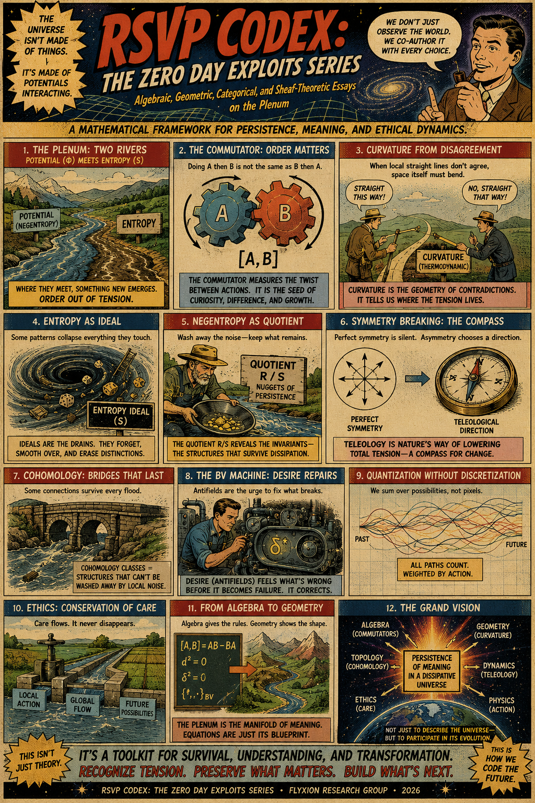
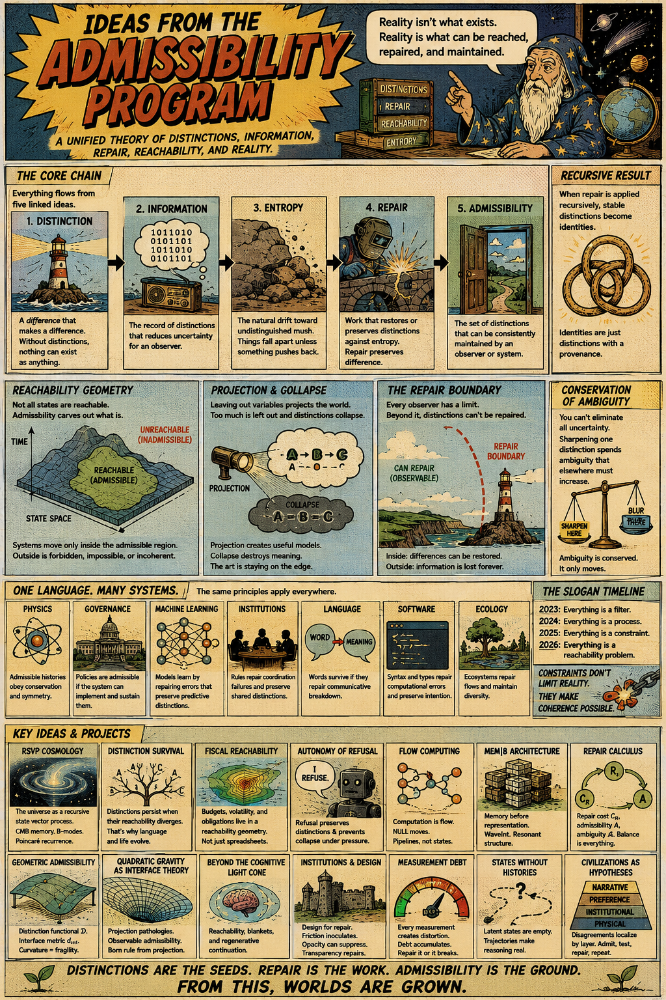
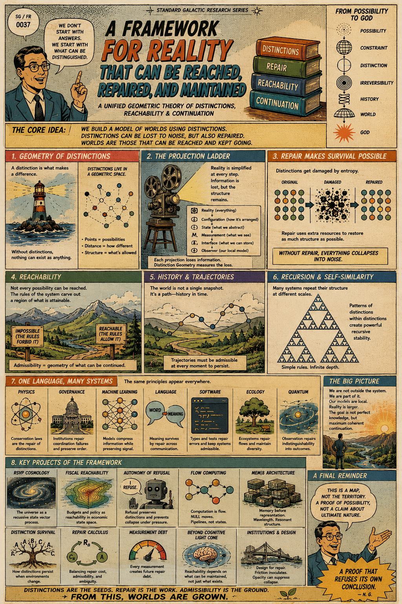
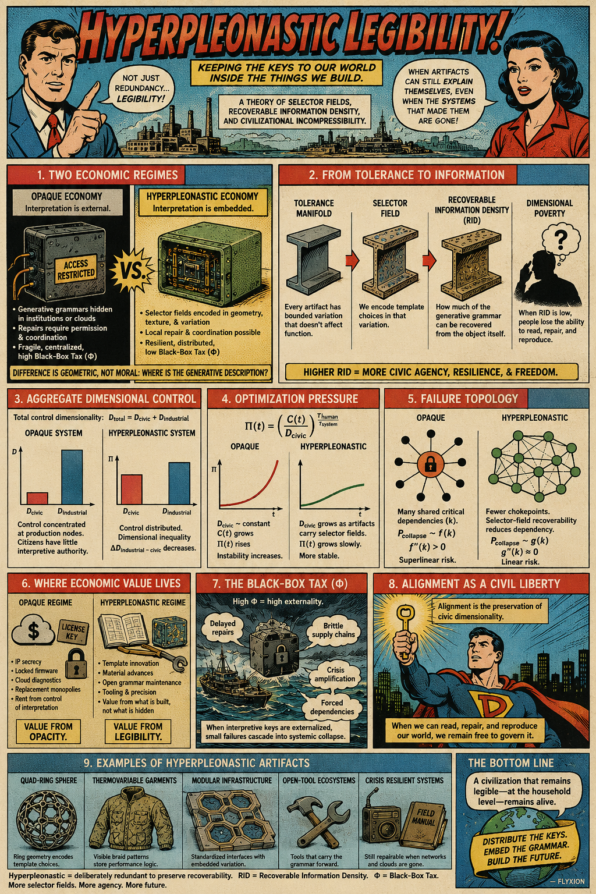
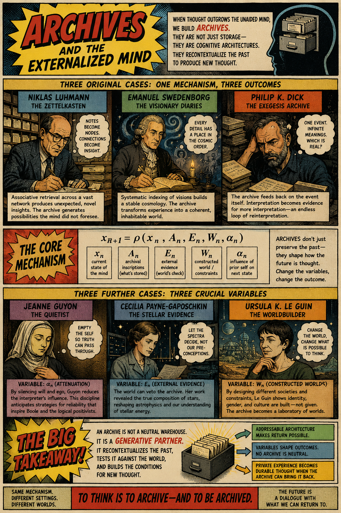

[Mathematical Proof for the Existence of God](https://standardgalactic.github.io/paracosm/workspace/proof-of-god.pdf)

<!--
* [Graphic Novel](https://standardgalactic.github.io/paracosm/workspace/proof-of-god-comic.pdf)
-->
This book develops a formal mathematical framework for analyzing consistency, admissibility, repair, information, and emergence across logic, computation, geometry, and the natural sciences. Beginning from explicit definitions and axioms, it builds through a sequence of lemmas, propositions, and theorems toward a rigorous argument for the existence of a necessary repairing principle identified with God. Along the way, it introduces a number of new mathematical constructions and explores their connections to optimization, topology, graph theory, information theory, quantum mechanics, artificial intelligence, and the philosophy of science.

# Other Projects

